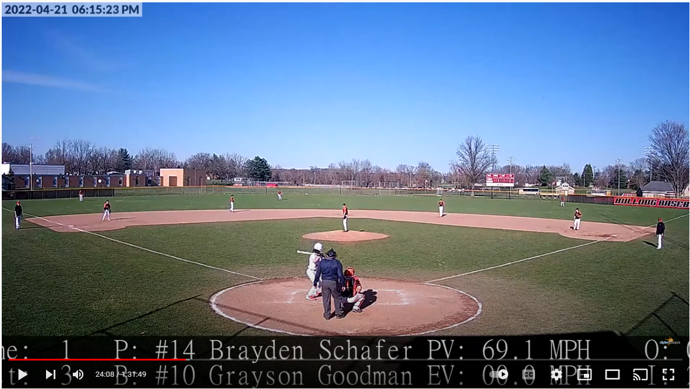
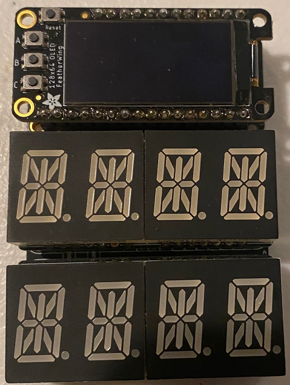
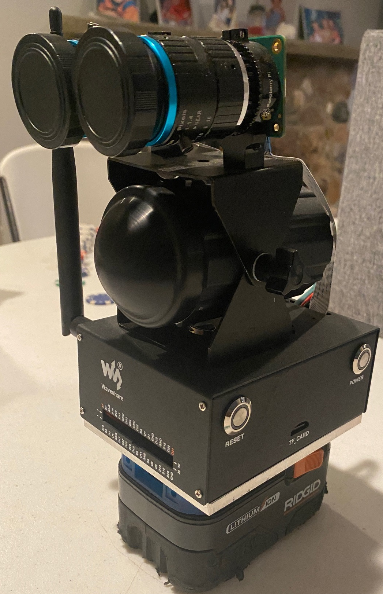

# Digital Example LLC Radar Gun Monitor
# Stalker Pro II Radar OEM Sensor Web Based Monitor #

### Intro ###

Last Update 4/24/2022

This application is under active development by Andrew DeVries for Digital Example, LLC all rights reserved.

The Radar Gun Monitor is a node.js application using a Stalker Pro II OEM Speed Sensor as its primary speed sensor. Speed data is recorded and logged on local flash memory as well as presented to multiple clients over tcp web client.

I have added a game mode to allow the scoring of the game, innings, outs, strikes, balls, batter and pitcher. This data can be overlayed onto a RTSP vidio source and then sent outbound as a RTMP vidio output. Currently I use this to feed YouTube but any RTMP distination url can be used.  Because 4K RTSP to RTMP requires hardware acceleration it can be offloaded to a desktop with an Nvidia cuda core graphics card.



Socket IO is used in the web client to give real time radar speed updates to the web browser and works with Apple/Andriod mobile devices. It is also used to feed the remote dugout radar displays.




### Installation and Setup ###
Currently the server can be ran on on raspberry pi or Windows machine.  The node.js supports using i2c led displays specificaly the Adafruit 7 segments displays. There is also a companion arduino app that allows the use of esp32 with multiple displays to remotly display radar data.  https://github.com/Andrewiski/radarClient-Esp32-SocketIO

The GPS is used to set the time so the logs are timestamped, if there is no interent NTP data. This is realy there for future portable development using the Jetson Nano with dual Raspberry HD camera and lenses and radar attached that runs on Ridgid battery packs.



 MongoDB is the plan for loggin with work on export to Google Sheets per session planned for charting graphing over time.


Tested Raspberry Pi 4 setup is as follows.

Using the Raspberry Pi OS (64-bit) - Raspberry Pi OS Lite Release date: April 4th 2022  image from https://www.raspberrypi.com/software/operating-systems/

'''
curl -sSL https://github.com/Andrewiski/RadarGun/blob/master/install/raspberryPiInstall.sh | sudo bash -
'''


 if we are using i2c ledDisplays lets make sure we can detect them on the i2c bus

```
##sudo apt-get install i2c-tools
ls -l /dev/i2c*
sudo i2cdetect -l
sudo i2cdetect -r 2
```

Download Setup the Radar Controller NPM Project

```
 sudo mkdir /var/radar
 sudo chmod a+rw /var/radar
 cd  /var/radar
 git clone https://github.com/Andrewiski/RadarGun.git .
 # no sudo for this one
 npm install
 sudo DEBUG=app,dataDisplay,radar,adafruitLedBackpack,gpsMonitor,radarEmulator npm start

```

Make it run as a service using Forever

```
 sudo npm install -g forever

 sudo cp /var/radar/service/radarMonitor /etc/init.d/radarMonitor
 sudo chmod a+x /etc/init.d/radarMonitor
 sudo update-rc.d radarMonitor defaults
 sudo service radarMonitor start
```

Now Open a web browser and connect to the RaspberryPi.

http://192.168.7.2:12336 


### Updates ###

```
Comming Soon via sheel script

```

### Conectors ###
the sample config files expect the Stalker Pro 2 OEM Radar unit to be attached to /dev/ttyS0.

I use a simple 4 wire male rs232 signal converter to get the correct 3.3v ttl signals.

The radar should be setup with direction to both,  hit and peak speeds disabled, no message delay, baud rate of 115200, and in be format. This application does allow for the limited
 config of setting via the web interface but port speed is not one of them. I susgest using the scoreboard app that comes with the OEM unit for inital config.  
 Note that with message delay set to none the data stream can over whelm the scoreboard app so I suggest do a soft off on the transmiter called a hold before attemping to change settings.

 Then use the web app to enable (turn on) the radar transmitter.  The App will auto timeout the radar and turn off the transmitter if no speeds are detected 
 but will prompt the web client to Turn it back on. This is to save battery and preserve the life or the radar unit if it is left on for extended periods of time.

